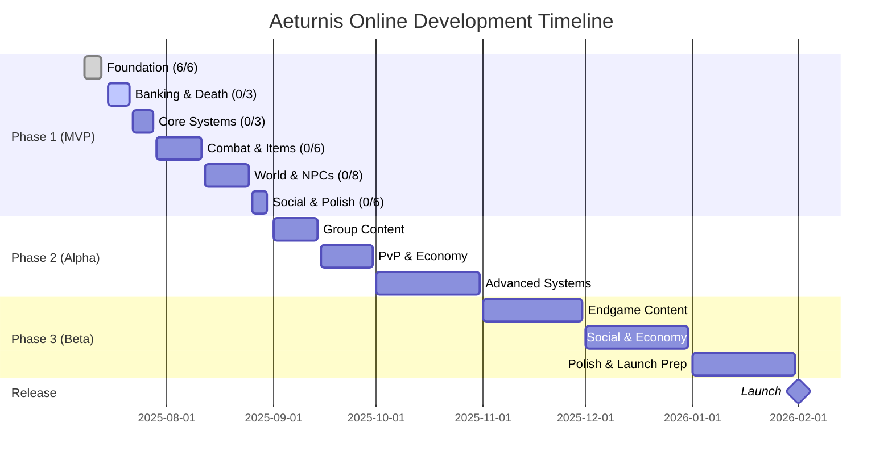
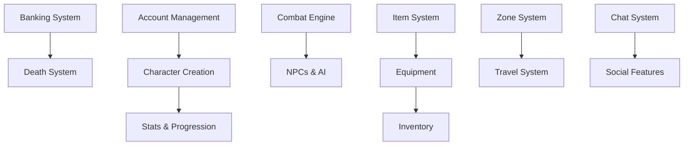

# 🗺️ Aeturnis Online - Development Roadmap

## 📅 Timeline Overview

---

## 🎮 Phase 1: MVP Development (July - August 2025)

### ✅ Completed Systems (18.8%)

| System               | Feature                    | Status                                |
| -------------------- | -------------------------- | ------------------------------------- |
| 🏗️ Infrastructure    | CI/CD, Database, Monorepo  |  |
| 🏛️ Core Architecture | Services, DI, Event System |  |
| 🔐 Security & Auth   | JWT, Rate Limiting, Helmet |  |

### 🔄 Current Sprint (July 15-21)

| System             | Feature                     | Priority    | Progress                          |
| ------------------ | --------------------------- | ----------- | --------------------------------- |
| 🏦 Banking Service | Gold storage, bank tabs     | 🔴 Critical |  |
| 💀 Death & Respawn | Death penalties, graveyards | 🔴 Critical |  |
| 👤 Account Mgmt    | Character slots, profiles   | 🟡 High     |  |

### ⏳ Upcoming Systems

| Timeline         | Systems                     | Key Features                         |
| ---------------- | --------------------------- | ------------------------------------ |
| **Week 4 July**  | 📊 Monitoring, 🗂️ Character | Metrics, logging, character creation |
| **Week 1 Aug**   | ⚔️ Combat, 💫 Skills        | Real-time battles, class abilities   |
| **Week 2 Aug**   | 🎒 Items, ⚔️ Equipment      | Inventory, 15 equipment slots        |
| **Week 3 Aug**   | 🤖 NPCs, 🏪 Shops           | Vendors, AI, consumables             |
| **Week 4 Aug**   | 🗺️ Zones, 💬 Chat           | World navigation, 4 chat channels    |
| **Final Sprint** | 🎓 Tutorial, ⚙️ Settings    | New player experience, leaderboards  |

---

## 🧪 Phase 2: Alpha Testing (September - October 2025)

### 🎯 Major Systems

- **September**: Quest System, Party System, PvP Mechanics, Trading
- **October**: Dungeons, World Events, Basic Guilds

### 🚀 Key Features

| System           | Description                                   |
| ---------------- | --------------------------------------------- |
| ⚔️ PvP System    | 10-min cooldowns, 6 kills/hour max            |
| 🧭 Alignment     | Good/Evil system with visual indicators       |
| 🎉 Party System  | 5-player groups, loot distribution            |
| 📜 Quest System  | Chain quests, dailies, class-specific         |
| 💰 Trading       | Secure trades, auction house, mail system     |
| 🔄 Reincarnation | Keep items/gold, special races at high levels |

---

## 🎯 Phase 3: Beta Testing (November 2025 - January 2026)

### 📊 Content Goals

- **25+ advanced systems**
- **5 dungeons** with unique bosses
- **Instance system** for group content
- **100+ hours** of gameplay

### 🌟 Major Features

| Month        | Systems              | Description                           |
| ------------ | -------------------- | ------------------------------------- |
| **November** | Endgame Content      | 🏆 Achievements, 💎 Gems, 🔨 Crafting |
| **December** | Social & Economy     | 🏛️ Clans, 🏰 Kingdoms, 🏠 Housing     |
| **January**  | Polish & Launch Prep | 🤖 AI NPCs, 💑 Marriage, 🐕 Pets      |

---

## 🚀 Release (February 1, 2026)

### 🎁 Launch Features

- **6 playable races** + 4 special reincarnation races
- **8 distinct classes** with unique skill trees
- **Death Penalty**: Lose all unbanked gold + 20% XP
- **PvP System**: Open world with alignment consequences
- **4 Mandatory Chat Channels**: General, Trade, Help, Race
- **Banking System**: Essential for survival
- **Social Features**: Friends, guilds, marriage
- **Economy**: Trading, auction house, crafting

---

## 📈 Development Velocity

| Metric         | Current | Target | Status         |
| -------------- | ------- | ------ | -------------- |
| Systems/Day    | 3.0     | 0.54   | 🟢 5.5x        |
| Test Coverage  | 91%+    | 90%    | 🟢 Exceeding   |
| CI Success     | 100%    | 95%+   | 🟢 Exceeding   |
| MVP Completion | 18.8%   | 100%   | 🟡 On Schedule |

### 📊 Progress Tracking

**Phase 1 MVP (32 systems total)**

- ✅ Infrastructure: 6/6 systems (100%)
- 🔄 Core Game: 0/26 systems (0%)

**Overall Progress**: 

---

## 🏛️ Version Roadmap

| Version | Codename | Release Date | Key Systems                      |
| ------- | -------- | ------------ | -------------------------------- |
| v1.0.0  | Jörmun   | ✅ Jul 13    | Foundation & Infrastructure      |
| v1.1.0  | Fenrir   | Jul 21       | Banking, Death, Accounts         |
| v1.2.0  | Týr      | Jul 28       | Monitoring, Character Creation   |
| v1.3.0  | Odin     | Aug 4        | Stats, Combat, Skills            |
| v1.4.0  | Thor     | Aug 11       | Items, Equipment, Inventory      |
| v1.5.0  | Loki     | Aug 18       | NPCs, AI, Loot, Shops            |
| v1.6.0  | Freya    | Aug 25       | Zones, Travel, Chat, Friends     |
| v1.7.0  | Heimdall | Aug 30       | Tutorial, Settings, Leaderboards |
| v2.0.0  | Ragnarök | Aug 30       | MVP Complete (32 systems)        |

---

## ⚡ Critical Path

---

## 📊 Phase 1 System Breakdown (32 Total)

### Infrastructure (6/6 ✅)

- [P1-S1-C] Package Management Setup ✅
- [P1-S1-A] GitHub Actions CI ✅
- [P1-S1-B] Initial DB Schema & Migrations ✅
- [Coverage] Test Coverage Enhancement ✅
- [P1-S1-1] Core Architecture ✅
- [P1-S1-2] Security & Auth ✅

### Remaining Systems (0/26 ⏳)

- [P1-S1-3] Monitoring & Logging
- [P1-S1-4] Cache & Performance
- [P1-S2-1] Account Management
- [P1-S2-2] Character Creation
- [P1-S2-3] Stats & Progression
- [P1-S3-1] Item System
- [P1-S3-2] Equipment Service
- [P1-S3-3] Inventory Management
- [P1-S4-1] Core Combat Engine
- [P1-S4-2] Skill System
- [P1-S5-1] NPC System
- [P1-S5-2] Basic AI Service
- [P1-S6-1] Loot System
- [P1-S6-2] Shop System
- [P1-S7-1] Banking Service 🔴
- [P1-S7-2] Death & Respawn 🔴
- [P1-S8-1] Zone Service
- [P1-S8-2] Travel System
- [P1-S9-1] Complete Chat System
- [P1-S10-1] Friend System
- [P1-S11-1] Tutorial System
- [P1-S12-1] Settings Management
- [P1-S15-1] Leaderboard Service

---

## 🔔 Stay Updated

- 📱 **Discord**: Join our community
- 🐦 **Twitter**: @AeturnisOnline
- 📺 **YouTube**: Development vlogs
- 📝 **Blog**: Weekly progress reports
- 🐙 **GitHub**: [View Repository](https://github.com/Aeturnia/Aeturnis-Project)

---

## ⚠️ Risk Mitigation

| Risk           | Impact            | Mitigation                          |
| -------------- | ----------------- | ----------------------------------- |
| Velocity Drop  | Delayed MVP       | 5.5x buffer, can drop to 1/day      |
| Technical Debt | Quality Issues    | 90%+ test coverage requirement      |
| Scope Creep    | Timeline Slip     | Strict MVP feature set (32 systems) |
| Dependencies   | Blocking Progress | Critical path identified            |

---

**Current Focus: Banking & Death Systems** 💀🏦

_"Death comes for all who venture unprepared. Bank your gold or lose it
forever."_

