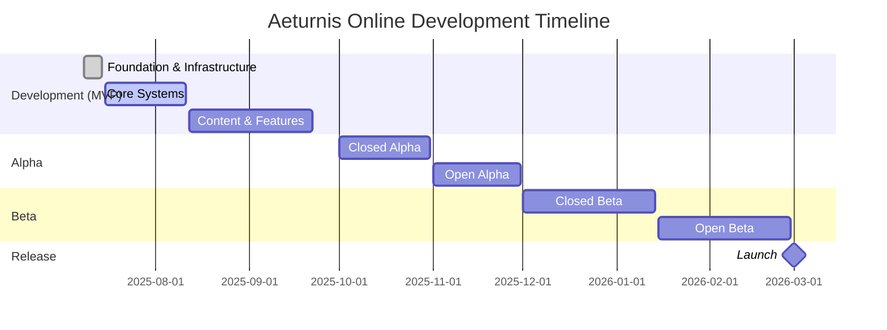

# 🗺️ Aeturnis Online - Development Roadmap

## 📅 Timeline Overview

---

## 🎮 Development Phase (July - September 2025)

### ✅ Completed (15.6%)

| System               | Feature                    | Status                                |
| -------------------- | -------------------------- | ------------------------------------- |
| 🏗️ Infrastructure    | CI/CD, Database, Monorepo  |  |
| 🏛️ Core Architecture | Services, DI, Event System |  |

### 🔄 In Progress (July 2025)

| System                | Feature                       | Target | Priority    |
| --------------------- | ----------------------------- | ------ | ----------- |
| 🏦 Banking Service    | Gold storage, death penalties | Week 3 | 🔴 Critical |
| 👤 Account Management | Login, authentication         | Week 3 | 🔴 Critical |
| 💀 Death & Respawn    | Core game mechanic            | Week 3 | 🔴 Critical |

### ⏳ Upcoming (July-August 2025)

| Timeline        | Systems                    | Key Features                       |
| --------------- | -------------------------- | ---------------------------------- |
| **Week 4 July** | ⚔️ Combat, 💬 Chat         | Real-time battles, 4 chat channels |
| **Week 1 Aug**  | 🧙 Characters, 📊 Stats    | 6 races, 8 classes, progression    |
| **Week 2 Aug**  | 🎒 Inventory, ⚔️ Equipment | Items, 15 equipment slots          |
| **Week 3 Aug**  | 🤖 NPCs, 🏪 Shops          | Vendors, basic AI                  |
| **Week 4 Aug**  | 🗺️ Zones, 🚶 Travel        | World navigation                   |

---

## 🧪 Alpha Phase (October - November 2025)

### 🎯 Major Milestones

- **October 1**: Closed Alpha begins (limited invites)
- **October 25-27**: First stress test weekend
- **November 15**: Open Alpha (public testing)

### 🚀 Key Features

| Month        | Focus Area       | New Systems                                                 |
| ------------ | ---------------- | ----------------------------------------------------------- |
| **October**  | Core Gameplay    | ✨ Quests 👥 Party System ⚔️ PvP Zones 🏰 Dungeons |
| **November** | Social & Economy | 🛡️ Guilds 💰 Trading 🔨 Crafting 🏆 Achievements   |

---

## 🎯 Beta Phase (December 2025 - February 2026)

### 📊 Content Goals

- **20+ zones** to explore
- **5 dungeons** with unique bosses
- **2 raid instances** for endgame
- **100+ hours** of content

### 🌟 Major Features

| Month        | Systems              | Description                          |
| ------------ | -------------------- | ------------------------------------ |
| **December** | Endgame Content      | 🐉 Raids, 🏟️ Arena PvP, 🏠 Housing   |
| **January**  | Economy & QoL        | 🏛️ Auction House, 🐴 Mounts, 🐕 Pets |
| **February** | Polish & Launch Prep | 🎤 Voice Chat, 🎮 Controller Support |

---

## 🚀 Release (March 1, 2026)

### 🎁 Launch Features

- **6 playable races** with unique abilities
- **8 distinct classes** with skill trees
- **PvP System**: Open world + structured arena
- **PvE Content**: Quests, dungeons, raids
- **Social Features**: Guilds, friends, chat
- **Economy**: Player trading, auction house
- **Progression**: 100 levels, achievements, titles

---

## 📈 Development Velocity

| Metric        | Current | Target |
| ------------- | ------- | ------ |
| Systems/Day   | 2.5     | 2.0    |
| Test Coverage | 48.63%  | 90%    |
| CI Success    | 100%    | 95%+   |
| Code Quality  | A+      | A+     |

---

## 🔔 Stay Updated

- 📱 **Discord**: Join our community
- 🐦 **Twitter**: @AeturnisOnline
- 📺 **YouTube**: Development vlogs
- 📝 **Blog**: Weekly progress reports
- 🐙 **GitHub**: [View Repository](https://github.com/Aeturnia/Aeturnis-Project)

---

## ⚠️ Disclaimer

_All dates are estimates based on current development velocity. Features and
timelines subject to change based on testing feedback and technical
requirements. We prioritize quality over speed._

---

**Current Status: Building the Foundation** 🏗️

_"Jörmun rises from the depths, laying the groundwork for worlds to come."_

