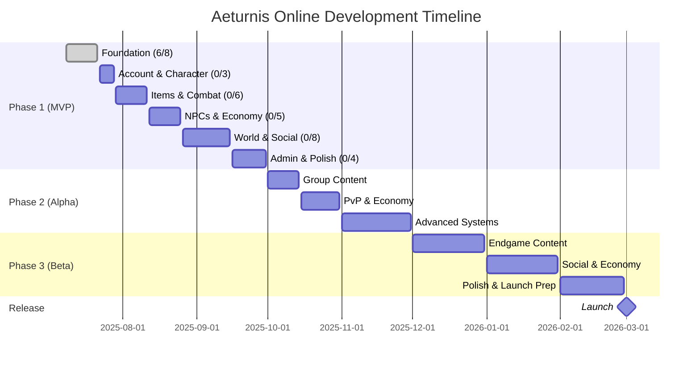
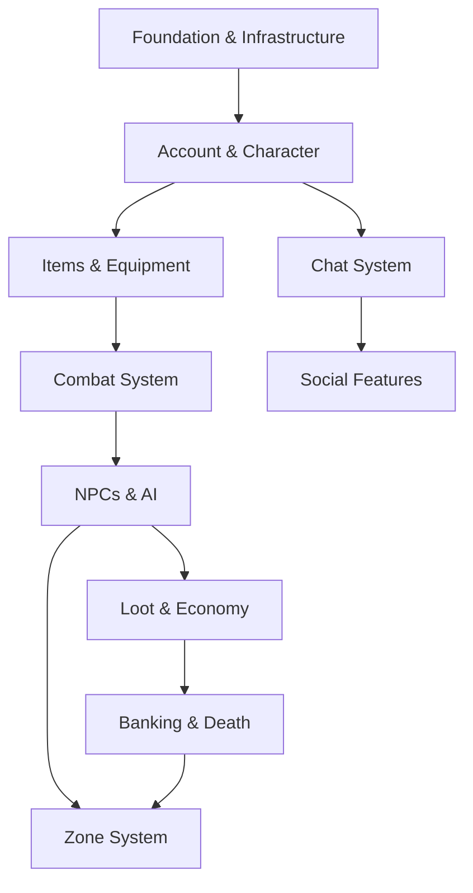

# 🗺️ Aeturnis Online - Development Roadmap

## 📅 Timeline Overview

---

## 🎮 Phase 1: MVP Development (July - September 2025)

### ✅ Completed Systems (18.8%)

| System               | Feature                    | Status                                |
| -------------------- | -------------------------- | ------------------------------------- |
| 🏗️ Infrastructure    | CI/CD, Database, Monorepo  |  |
| 🏛️ Core Architecture | Services, DI, Event System |  |
| 🔐 Security & Auth   | JWT, Rate Limiting, Helmet |  |

### 🔄 Current Sprint (July 15-21) - Following Implementation Plan v5.0

| System                  | Feature                     | Priority     | Progress                          |
| ----------------------- | --------------------------- | ------------ | --------------------------------- |
| 📊 Monitoring & Logging | Metrics, error tracking     | 🟢 Next      |  |
| 🚀 Cache & Performance  | Multi-tier caching, preload | 🟢 Next      |  |
| 👤 Account Management   | Multi-character, GDPR       | 🟡 Following |  |

### ⏳ Upcoming Systems (Implementation Plan Order)

| Timeline        | Systems                | Key Features                        |
| --------------- | ---------------------- | ----------------------------------- |
| **Week 4 July** | 🎭 Character, 📈 Stats | Character creation, stat allocation |
| **Week 1 Aug**  | 🎒 Items, ⚔️ Equipment | Item system, 15 equipment slots     |
| **Week 2 Aug**  | ⚔️ Combat, 💫 Skills   | Real-time combat, skill trees       |
| **Week 3 Aug**  | 🤖 NPCs, 💰 Loot       | AI behavior, loot tables            |
| **Week 4 Aug**  | 🏦 Banking, 💀 Death   | Gold banking, death penalties       |
| **Sept**        | 💬 Chat, 👥 Social     | 4 channels, friends, tutorials      |

---

## 🧪 Phase 2: Alpha Testing (October - November 2025)

### 🎯 Major Systems

- **October**: Quest System, Party System, PvP Mechanics, Trading
- **November**: Dungeons, World Events, Basic Guilds

### 🚀 Key Features

| System           | Description                                   |
| ---------------- | --------------------------------------------- |
| ⚔️ PvP System    | 10-min cooldowns, 6 kills/hour max            |
| 🧭 Alignment     | Good/Evil system with visual indicators       |
| 🎉 Party System  | 5-player groups, loot distribution            |
| 📜 Quest System  | Chain quests, dailies, class-specific         |
| 💰 Trading       | Secure trades, auction house, mail system     |
| 🔄 Reincarnation | Keep items/gold, special races at high levels |

---

## 🎯 Phase 3: Beta Testing (December 2025 - February 2026)

### 📊 Content Goals

- **25+ advanced systems**
- **5 dungeons** with unique bosses
- **Instance system** for group content
- **100+ hours** of gameplay

### 🌟 Major Features

| Month        | Systems              | Description                           |
| ------------ | -------------------- | ------------------------------------- |
| **December** | Endgame Content      | 🏆 Achievements, 💎 Gems, 🔨 Crafting |
| **January**  | Social & Economy     | 🏛️ Clans, 🏰 Kingdoms, 🏠 Housing     |
| **February** | Polish & Launch Prep | 🤖 AI NPCs, 💑 Marriage, 🐕 Pets      |

---

## 🚀 Release (March 1, 2026)

### 🎁 Launch Features

- **6 playable races** + 4 special reincarnation races
- **8 distinct classes** with unique skill trees
- **Death Penalty**: Lose all unbanked gold + 20% XP
- **PvP System**: Open world with alignment consequences
- **4 Mandatory Chat Channels**: General, Trade, Help, Race
- **Banking System**: Essential for survival
- **Social Features**: Friends, guilds, marriage
- **Economy**: Trading, auction house, crafting

---

## 📈 Development Velocity

| Metric         | Current | Target | Status         |
| -------------- | ------- | ------ | -------------- |
| Systems/Day    | 3.0     | 0.33   | 🟢 9x          |
| Test Coverage  | 91%+    | 90%    | 🟢 Exceeding   |
| CI Success     | 100%    | 95%+   | 🟢 Exceeding   |
| MVP Completion | 18.8%   | 100%   | 🟡 On Schedule |

### 📊 Progress Tracking

**Phase 1 MVP (32+ systems total)**

- ✅ Infrastructure: 6/8 systems (75%)
- 🔄 Core Game: 0/24+ systems (0%)

**Overall Progress**: 

---

## 🏛️ Version Roadmap (Following Implementation Plan v5.0)

| Version | Codename | Release Date | Key Systems                 |
| ------- | -------- | ------------ | --------------------------- |
| v1.0.0  | Jörmun   | ✅ Jul 13    | Foundation & Infrastructure |
| v1.1.0  | Fenrir   | Jul 21       | Monitoring, Cache, Account  |
| v1.2.0  | Týr      | Jul 28       | Character Systems           |
| v1.3.0  | Odin     | Aug 4        | Items & Equipment           |
| v1.4.0  | Thor     | Aug 11       | Combat & Skills             |
| v1.5.0  | Loki     | Aug 18       | NPCs, AI, Loot, Economy     |
| v1.6.0  | Freya    | Aug 25       | Banking, Death, Zones       |
| v1.7.0  | Heimdall | Sep 8        | Chat & Social               |
| v1.8.0  | Baldur   | Sep 22       | Admin & Anti-Cheat          |
| v2.0.0  | Ragnarök | Sep 30       | MVP Complete                |

---

## ⚡ Critical Path (Implementation Plan v5.0)

**Important**: Banking is NOT an early priority. It requires:

- Loot system to generate gold
- Economy foundation for currency
- Item system for item banking

---

## 📊 Phase 1 System Breakdown (32+ Total)

### Infrastructure (8 systems - 6/8 ✅)

- [P1-S1-C] Package Management ✅
- [P1-S1-A] GitHub Actions CI ✅
- [P1-S1-B] DB Schema & Migrations ✅
- [Coverage] Test Coverage ✅
- [P1-S1-1] Core Architecture ✅
- [P1-S1-2] Security & Auth ✅
- [P1-S1-3] Monitoring & Logging ⏳
- [P1-S1-4] Cache & Performance ⏳

### Core Game Systems (24+ remaining)

Following Implementation Plan v5.0 order:

- Account & Character (3)
- Items & Equipment (3)
- Combat & Skills (3)
- NPCs & AI (2)
- Loot & Economy (3)
- Banking & Death (2) ← Late in order
- Zones & World (2)
- Communication (2)
- Social (2)
- Tutorial & Support (2)
- Administration (3)
- Competitive (1)

---

## 🔔 Stay Updated

- 📱 **Discord**: Join our community
- 🐦 **Twitter**: @AeturnisOnline
- 📺 **YouTube**: Development vlogs
- 📝 **Blog**: Weekly progress reports
- 🐙 **GitHub**: [View Repository](https://github.com/Aeturnia/Aeturnis-Project)

---

## ⚠️ Risk Mitigation

| Risk           | Impact            | Mitigation                         |
| -------------- | ----------------- | ---------------------------------- |
| Velocity Drop  | Delayed MVP       | 9x buffer, can drop to 0.33/day    |
| Wrong Order    | Breaking Changes  | Following Implementation Plan v5.0 |
| Technical Debt | Quality Issues    | 90%+ test coverage requirement     |
| Dependencies   | Blocking Progress | Clear dependency chain established |

---

**Current Focus: Monitoring & Logging System** 📊🔍

_"Following the Implementation Plan v5.0 to ensure proper system dependencies"_

